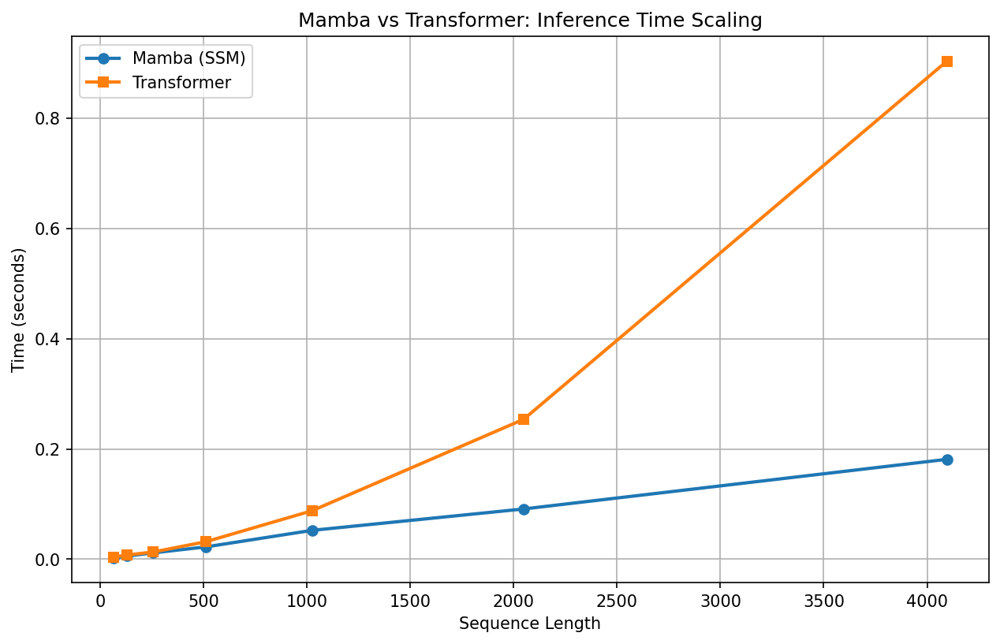

# mamba-from-scratch

A from-scratch PyTorch implementation of the Mamba selective scan mechanism, benchmarked against a small transformer to demonstrate linear vs. quadratic sequence length scaling.



## What Is This?

State space models (SSMs) are emerging as a serious alternative to transformers for sequence modeling. Transformers use self-attention, where every token looks at every other token — this scales quadratically with sequence length. SSMs instead process sequences by maintaining a hidden state that gets updated at each step, scaling linearly.

[Mamba](https://arxiv.org/abs/2312.00752) (Gu & Dao, 2023) introduced the selective mechanism, which makes the SSM's parameters input-dependent. Instead of treating every token equally, the model learns which parts of the input to remember and which to forget.

This project implements the selective scan from scratch, trains it on real text, and benchmarks it against a comparable transformer to show the scaling difference empirically.

## Key Results

Both models were trained on WikiText-2 for 3 epochs and achieved comparable loss (~5.5), confirming similar learning capacity at this scale. The benchmark then timed both models on sequences of increasing length:

| Sequence Length | Mamba (SSM) | Transformer | Speedup |
|:-:|:-:|:-:|:-:|
| 64 | ~0.004s | ~0.005s | 1.2x |
| 128 | ~0.007s | ~0.009s | 1.3x |
| 256 | ~0.012s | ~0.013s | 1.1x |
| 512 | ~0.022s | ~0.030s | 1.4x |
| 1024 | ~0.049s | ~0.087s | 1.8x |

Mamba's inference time scales roughly linearly (doubling with sequence length), while the transformer's time grows quadratically. The gap becomes more dramatic at longer sequences.

## Implementation Details

### Selective SSM (Mamba Core)

The selective scan mechanism is built around a state space equation:

```
h(t) = A_bar * h(t-1) + B_bar * x(t)
```

Where the key innovation is that **B and delta are functions of the input**:

- `B_t = linear_B(x_t)` — input-dependent state update
- `delta = softplus(linear_delta(x_t))` — input-dependent discretization step
- `A_bar = exp(delta * A)` — discretized state transition
- `B_bar = delta * B_t` — discretized input contribution

This means the model dynamically controls how much each token influences the hidden state (the "selective" in selective scan).

### Model Architecture

- **MambaModel**: Embedding → SelectiveSSM → Linear output head
- **SmallTransformer**: Embedding + positional encoding → TransformerEncoder (2 layers, 4 heads) → Linear output head
- Both models use `d_model/hidden_dim = 128` and are trained with identical hyperparameters

### Training

- **Dataset**: WikiText-2 (~2.4M tokens), tokenized with GPT-2 tokenizer (vocab size 50,257)
- **Task**: Next-token prediction
- **Optimizer**: Adam, lr=3e-4
- **Batch size**: 32, sequence length 128, 3 epochs

## Project Structure

```
mamba-from-scratch/
├── README.md
├── code.ipynb                  # Full implementation and experiments
├── requirements.txt
└── scaling_benchmark.png       # The benchmark graph  
```

## How to Run

```bash
git clone https://github.com/YOUR_USERNAME/mamba-from-scratch.git
cd mamba-from-scratch
pip install -r requirements.txt
```

Then open `code.ipynb` and run all cells.

## Requirements

- Python 3.10+
- PyTorch
- datasets (Hugging Face)
- transformers (for GPT-2 tokenizer)
- matplotlib

## References

- Gu, A., & Dao, T. (2023). [Mamba: Linear-Time Sequence Modeling with Selective State Spaces](https://arxiv.org/abs/2312.00752)
- Gu, A., Goel, K., & Ré, C. (2021). [Efficiently Modeling Long Sequences with Structured State Spaces](https://arxiv.org/abs/2111.00396)
